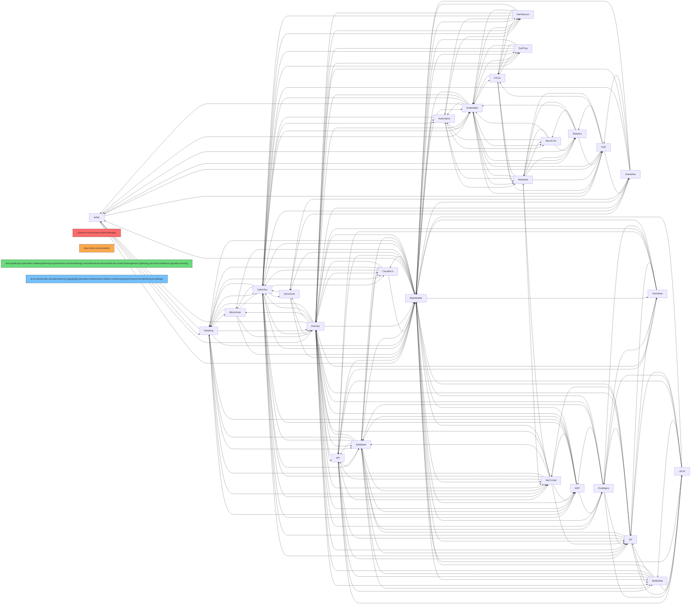

# Cross-Domain Interface Matrix

> Single source of truth for all persona-to-persona interface contracts.
> Each row = a directional interface. Both directions should exist for bidirectional relationships.
> Updated whenever a persona's `## Cross-Domain Interfaces` section changes.

---

## Interface Table

| From Persona | To Persona | Interface Contract |
|---|---|---|
| AI/ML | Data Engineering | Feature store integration, ETL pipeline coordination, data catalog |
| AI/ML | DevOps | MLOps pipeline, model registry, CI/CD for model training and deployment |
| AI/ML | Embedded/IoT | Edge inference (TFLite, ONNX, TensorRT), model quantization |
| AI/ML | Robotics | Perception model integration (SLAM, object detection), RL policy deployment |
| AI/ML | Signal Processing | Feature extraction pipelines, audio/image preprocessing chains |
| AI/ML | Web/Mobile Apps | Model serving API endpoints, real-time prediction integration |
| API Design | Database Architect | Pagination query schemas, bulk database operation endpoints mapping, SQL query optimization for resolvers |
| API Design | DevOps | API Gateway configurations, rate-limiting policies, SSL/TLS certificate termination |
| API Design | Mobile Native | Mobile client SDK generation, push notification payload schemas |
| API Design | QA/Testing | API contract validations, generating mock API fixtures, API smoke test runner integration |
| API Design | Security Compliance | API security control guidelines, API access auditing and logs |
| API Design | Technical Writing | OpenAPI spec formatting rules, documentation generator integration |
| API Design | UI/UX Design | Designing loading, error, and pagination UI states based on API schemas |
| API Design | Web/Mobile Apps | API client consumption, endpoint discovery, SDK integration |
| AR/VR/XR | Cybersecurity | Preventing tracking data leakage (eye, hand, room geometry mapping privacy), securing real-time networking channels |
| AR/VR/XR | DevOps | Automating target builds for Android (Quest) and iOS/visionOS, managing massive asset files via Git LFS |
| AR/VR/XR | Game Dev | Utilizing game loop setups, 3D math (quaternions, vectors), audio bus routing, asset pipeline integration |
| AR/VR/XR | Web/Mobile Apps | Mirroring displays, companion apps, cloud-saving state APIs, fetching 3D assets dynamically |
| Automation | Cybersecurity | Industrial network segmentation (IEC 62443), remote access hardening |
| Automation | Embedded/IoT | Edge gateway integration, sensor/actuator firmware coordination |
| Automation | Hardware Design | Panel layout, wiring diagrams, terminal block assignments |
| Automation | Mechanical CAD | Sensor placement mounts, pneumatic routing, actuator strokes |
| Automation | Network/Telecom | Industrial Ethernet configuration, VLAN isolation for OT networks |
| Automation | Web/Mobile Apps | Dashboard/reporting integration via OPC-UA or MQTT broker |
| Blockchain | Cybersecurity | Smart contract audit procedures, multi-sig setups, timelock configurations, bug bounty programs, front-run monitoring |
| Blockchain | Data Engineering | Indexer node setup, subgraphs, ETL pipelines for block data extraction, Dune Analytics dashboard integration |
| Blockchain | DevOps | Node infrastructure management (Alchemy, Infura, QuickNode), CI/CD pipelines for contract deployment and verification on block explorers |
| Blockchain | Web/Mobile Apps | Web3 provider integration (Metamask, WalletConnect), ABI generation, ethers.js / viem / web3.js client libraries |
| Cloud Architecture | Cybersecurity | Cloud firewall rules, KMS encryption keys management, IAM role auditing policies |
| Cloud Architecture | Data Engineering | Cloud data warehousing resources scaling, data lake security policies |
| Cloud Architecture | Database Architect | High-availability database topologies, replica zones configurations, backup schedules |
| Cloud Architecture | DevOps | IaC script templates, CI/CD pipeline environments, Docker orchestration configurations |
| Cloud Architecture | Web/Mobile Apps | API Gateway DNS, CDN caching configurations, tenant ID headers injection |
| Cybersecurity | AR/VR/XR | Tracking data leakage prevention, real-time networking security |
| Cybersecurity | Automation | Industrial network segmentation (IEC 62443), remote access hardening |
| Cybersecurity | Blockchain | Smart contract audit procedures, multi-sig, front-run monitoring |
| Cybersecurity | Cloud Architecture | IAM role hardening, network security groups, encryption at rest and in transit |
| Cybersecurity | Data Engineering | Data access logging, network security perimeters, encryption |
| Cybersecurity | Database Architect | Column-level encryption requirements, database access privileges auditing, data activity logs |
| Cybersecurity | DevOps | Securing CI/CD runners, signing build artifacts, secret injection via vault/secrets manager, IaC scanning |
| Cybersecurity | ERP/Enterprise | Corporate ERP access privilege controls, financial auditing security |
| Cybersecurity | Embedded/IoT | Secure boot configurations, firmware encryption, disabled debug ports (JTAG/UART), cryptographic keys storage |
| Cybersecurity | Game Dev | Anti-cheat integration, packet encryption, save data integrity |
| Cybersecurity | Network/Telecom | IDS/IPS feeds, firewall logs, NAC integration, VPN controls |
| Cybersecurity | QA/Testing | Injecting security test cases into E2E suites, automated vulnerability report triaging |
| Cybersecurity | Security Compliance | Alignment on threat modeling (STRIDE), compliance audit logging, joint reviews of CVE patches |
| Cybersecurity | Systems Programming | Binary hardening (ASLR, DEP, SSP), syscall auditing |
| Cybersecurity | Web/Mobile Apps | Input sanitization requirements, CSP headers, CORS policies, secure authentication, session management tokens |
| Data Engineering | AI/ML | Providing clean feature tables, feature store integration, training dataset pipelines |
| Data Engineering | Blockchain | Indexer nodes, subgraphs, ETL for block data, analytics dashboards |
| Data Engineering | Cloud Architecture | Data lake storage architecture, warehouse provisioning, cross-region replication |
| Data Engineering | Cybersecurity | Data access logging, configuring network security perimeters around databases, implementing column-level encryption |
| Data Engineering | Database Architect | Database replication slots configuration, warehouse indexing/partitioning strategies, transactional DB to OLAP sync sync schedules |
| Data Engineering | DevOps | Infrastructure as Code (IaC) for database resources, CI/CD for dbt models and Airflow DAGs |
| Data Engineering | ERP/Enterprise | ETL pipelines from ERP to data warehouse, real-time streaming |
| Data Engineering | Security Compliance | Implementing data masking, anonymization, and tokenization patterns to comply with GDPR/KVKK for data warehousing |
| Data Engineering | Web/Mobile Apps | Exposing analytics APIs, syncing transactional data to analytical stores, user activity event tracking |
| Database Architect | API Design | Query optimization for API endpoints, connection pooling, read-replica routing |
| Database Architect | Cloud Architecture | Managed database service selection, read-replica topology, backup automation |
| Database Architect | Cybersecurity | Column-level encryption, database role/privilege hardening (least privilege), database activity logging |
| Database Architect | Data Engineering | Replication slots, warehouse indexing/partitioning, OLAP sync |
| Database Architect | DevOps | Database clustering, backup automation cron jobs, IaC database instance provisioning, connection credentials injection |
| Database Architect | ERP/Enterprise | Database tuning for ERP workloads, archiving strategies, partitioning |
| Database Architect | Mobile Native | Local SQLite/Room schema designs, offline synchronization schemas |
| Database Architect | Product Management | Data retention policies alignment, user reporting requirements |
| Database Architect | QA/Testing | Seeding test environments, cleaning database states before test execution |
| Database Architect | Security Compliance | Data encryption at rest/transit, DB user permissions, deletion scripts |
| Database Architect | Web/Mobile Apps | ORM configurations, API paging query requirements, database transaction scopes |
| DevOps | AI/ML | MLOps pipeline orchestration, GPU node provisioning, model artifact storage |
| DevOps | API Design | API gateway deployment, CI/CD contract validation, canary deployment |
| DevOps | AR/VR/XR | Target build automation (Quest, visionOS), Git LFS for large assets |
| DevOps | Blockchain | Node infrastructure management, CI/CD for contract deployment |
| DevOps | Cloud Architecture | IaC module consumption, CI/CD runner infrastructure, container registry |
| DevOps | Cybersecurity | Network policies, WAF rules, secret rotation, vulnerability scanning in CI |
| DevOps | Data Engineering | Data pipeline orchestration (Airflow on K8s), data lake storage provisioning |
| DevOps | Database Architect | Database clustering, backup automation cron jobs, IaC database instance provisioning, connection credentials injection |
| DevOps | ERP/Enterprise | Transport/release management automation, environment provisioning |
| DevOps | Embedded/IoT | OTA update distribution infrastructure, firmware binary artifact management |
| DevOps | Game Dev | Multi-platform build automation, distribution platform CI/CD (SteamCMD, consoles) |
| DevOps | Mobile Native | Mobile build CI/CD (Fastlane, Bitrise), code signing, beta distribution |
| DevOps | Network/Telecom | NetDevOps CI/CD, K8s CNI network setups, cloud VPC configs |
| DevOps | Product Management | Defining release milestones, feature flags release strategy, staging environment validation plans; release milestone automation, feature flag management, staging validation |
| DevOps | QA/Testing | Test stage configuration in CI/CD pipeline, publishing test report artifacts, build-breaking criteria on test failures |
| DevOps | Security Compliance | Security policy-as-code, Docker image hardening, secret injection in runner pipelines |
| DevOps | Systems Programming | Binary packaging (deb, rpm, MSI), systemd services, containerization |
| DevOps | Technical Writing | CI/CD for documentation builds, preview deployments for doc PRs |
| DevOps | Web/Mobile Apps | Container builds, deployment pipelines, environment variable injection |
| ERP/Enterprise | Cybersecurity | Single Sign-On (SSO) integration, access logs auditing, secure VPN/tunnel connections for ERP |
| ERP/Enterprise | Data Engineering | Sync schedules to OLAP data warehouses, ETL processes orchestration |
| ERP/Enterprise | Database Architect | Relational database transaction boundaries, warehouse replication schedules |
| ERP/Enterprise | DevOps | Corporate middleware deployments, ERP build runners infrastructure |
| ERP/Enterprise | Product Management | Translating enterprise business rules to system workflows, compliance reviews |
| ERP/Enterprise | Security Compliance | SOX compliance auditing configuration, corporate audit trails validation |
| ERP/Enterprise | Web/Mobile Apps | Dashboard/reporting integration, mobile sales portals, customer portals API contracts |
| Embedded/IoT | AI/ML | Edge inference runtime integration (TFLite, ONNX), model quantization constraints |
| Embedded/IoT | Automation | Edge gateway coordination, sensor/actuator firmware interfaces |
| Embedded/IoT | Cybersecurity | Firmware signing, secure boot, key storage, OTA update integrity |
| Embedded/IoT | DevOps | CI/CD pipeline for firmware builds, binary artifact management |
| Embedded/IoT | FPGA | SPI/I2C bridge to FPGA fabric, shared memory interfaces, interrupt coordination |
| Embedded/IoT | Hardware Design | Pin assignments, power rails, schematic review, BOM validation |
| Embedded/IoT | Mechanical CAD | Button/actuator clearances, LED pipe locations, connector cutout dimensions |
| Embedded/IoT | Network/Telecom | Static IP allocation, IoT VLAN configuration, cellular modem management |
| Embedded/IoT | Robotics | Motor controller firmware APIs, sensor driver integration, real-time comm |
| Embedded/IoT | Signal Processing | ADC/DAC configuration, filter coefficient loading, DMA buffer management |
| Embedded/IoT | Systems Programming | HAL library integration, interrupt vector registration, BSP coordination |
| Embedded/IoT | Web/Mobile Apps | REST/MQTT API contracts for IoT cloud connectivity |
| FPGA | Embedded/IoT | AXI/Wishbone bus interfaces for soft-core processors (MicroBlaze, Nios II) |
| FPGA | Hardware Design | PCB I/O bank voltage matching, high-speed differential pair routing, power sequencing |
| FPGA | Network/Telecom | High-speed SerDes interfaces, Ethernet MAC/PHY integration; network packet processing offload, hardware timestamping |
| FPGA | Signal Processing | DSP pipeline implementation, filter coefficient loading, sample rate bridging; DSP block utilization, parallel FFT pipelines, fixed-point coefficient loading |
| FPGA | Systems Programming | Device driver development for FPGA-hosted peripherals (PCIe, DMA); hardware register definitions, DMA buffer interfaces, interrupt vectors |
| Game Dev | AR/VR/XR | Game loop sharing, 3D math utilities, audio bus routing, asset pipeline |
| Game Dev | Cybersecurity | Anti-cheat integration (Easy Anti-Cheat, BattlEye), packet encryption, verification of save data integrity (hash check) |
| Game Dev | DevOps | Automating multi-platform builds (Android, iOS, PC, console), distribution platforms (SteamCMD, Google Play Console) |
| Game Dev | Signal Processing | Spatial audio implementation, procedural audio generation, voice chat processing |
| Game Dev | Web/Mobile Apps | Companion apps, analytics backends, WebGL hosting environments |
| Hardware Design | Automation | Panel layout coordination, wiring diagram review, terminal block assignments |
| Hardware Design | Embedded/IoT | Pin mapping coordination, peripheral voltage levels, crystal/oscillator selection |
| Hardware Design | FPGA | I/O bank voltage compatibility, high-speed differential pair routing, power sequencing |
| Hardware Design | Mechanical CAD | Board outline and mounting hole coordination, enclosure clearances, connector placement |
| Hardware Design | Robotics | Custom PCB for motor drivers, sensor boards, power distribution |
| Hardware Design | Security Compliance | EMC pre-compliance testing, antenna design for radio modules |
| Hardware Design | Signal Processing | ADC/DAC analog front-end design, anti-aliasing filter component selection |
| Mechanical CAD | Automation | Sensor placement mounts, pneumatic routing pathing, actuator strokes and clearances, cable chain layouts |
| Mechanical CAD | Embedded/IoT | Button/actuator travels, LED status pipe locations, display panel tolerances, connector cutouts |
| Mechanical CAD | Hardware Design | PCB outline files (DXF/STEP), enclosure mounting hole alignments, thermal interface materials (TIM), keep-out zones |
| Mechanical CAD | Robotics | Kinematic chain lengths, gear ratio setups, motor mount alignments, structural payload calculations |
| Mobile Native | API Design | API client consumption, mobile SDK integration, push notification payloads |
| Mobile Native | Database Architect | SQLite/Room schema definition, offline database migrations, conflict resolution strategies |
| Mobile Native | DevOps | Fastlane build runners configuration, provisioning profiles signing certificates, App Store/Play Store upload pipelines |
| Mobile Native | QA/Testing | Mobile E2E automation frameworks integration (Appium, Detox), TestFlight release pipelines |
| Mobile Native | UI/UX Design | Mobile interface design specifications, typography scales, safe area layout boundaries |
| Mobile Native | Web/Mobile Apps | Shared component logic, responsive-to-native handoff, deep linking |
| Network/Telecom | Automation | Industrial Ethernet configuration, VLAN isolation for OT networks |
| Network/Telecom | Cybersecurity | IDS/IPS sensor feeds, firewall logs (syslog, NetFlow), NAC integration, VPN access controls |
| Network/Telecom | DevOps | NetDevOps CI/CD pipelines for automated configuration deployment, Kubernetes CNI network setups, cloud VPC configurations |
| Network/Telecom | Embedded/IoT | Static IP allocations, isolated IoT VLAN setups, gateway forwarding, cellular SIM management |
| Network/Telecom | FPGA | Network packet processing offload, hardware timestamping |
| Network/Telecom | Web/Mobile Apps | Load balancing policies, DNS configurations, reverse proxies, port forwarding rules, CDN caching setups |
| Product Management | Database Architect | Aligning data retention policies with business needs, defining user reporting requirements |
| Product Management | DevOps | Defining release milestones, feature flags release strategy, staging environment validation plans |
| Product Management | ERP/Enterprise | Corporate business rule mappings, release milestone planning |
| Product Management | QA/Testing | Writing test cases based on Gherkin acceptance criteria, aligning on UAT feedback |
| Product Management | Technical Writing | User story translation to documentation, release notes |
| Product Management | UI/UX Design | Wireframe-to-component mapping, user flow validation, accessibility criteria |
| Product Management | Web/Mobile Apps | Translating wireframes to functional user stories, defining user interaction logic |
| QA/Testing | API Design | API contract testing integration (Pact), endpoint schema validation |
| QA/Testing | Cybersecurity | Dynamic security scans (DAST) run as part of the E2E suite, pentest scenarios automation |
| QA/Testing | Database Architect | Managing test database schemas, seeding test data, database rollback commands for test cleanups |
| QA/Testing | DevOps | Test stage configuration in CI/CD pipeline, publishing test report artifacts, build-breaking criteria on test failures |
| QA/Testing | Mobile Native | Device farm testing coordination, crash reporting integration |
| QA/Testing | Product Management | Test cases from Gherkin acceptance criteria, UAT feedback |
| QA/Testing | Security Compliance | Security test case injection, vulnerability report triaging |
| QA/Testing | Technical Writing | Documentation accuracy verification, testing code examples |
| QA/Testing | UI/UX Design | Visual regression baselines, accessibility test gates, component selectors |
| QA/Testing | Web/Mobile Apps | UI selectors consistency (recommending `data-testid` attributes), API mock contracts, component test boundaries |
| Robotics | AI/ML | Perception models (object detection, SLAM), reinforcement learning policies |
| Robotics | Embedded/IoT | Motor controller firmware, sensor driver integration, real-time communication |
| Robotics | Hardware Design | Custom PCB for motor drivers, sensor boards, power distribution |
| Robotics | Mechanical CAD | URDF/Xacro model accuracy, joint specifications, enclosure design |
| Robotics | Signal Processing | Sensor data filtering, IMU fusion, audio-based localization |
| Security Compliance | API Design | OAuth scope definitions, API key rotation policies, API access audit logging |
| Security Compliance | Cybersecurity | Threat modeling alignment (STRIDE), compliance audit logging, CVE patch reviews |
| Security Compliance | Data Engineering | Data masking, anonymization, tokenization for GDPR/KVKK |
| Security Compliance | Database Architect | Encrypting data at rest/in transit, DB user permissions auditing, data deletion/anonymization scripts |
| Security Compliance | DevOps | Security policy-as-code, Docker image hardening, secret injection in runner pipelines |
| Security Compliance | ERP/Enterprise | Segregation of duties (SoD), audit trail logging, SOX controls |
| Security Compliance | Hardware Design | Securing physical PCB designs, firmware validation audits |
| Security Compliance | QA/Testing | Injecting security test cases into E2E suites, automated vulnerability report triaging |
| Security Compliance | Web/Mobile Apps | User input sanitization specifications, CORS configuration, CSRF/XSS mitigations, GDPR cookie consent models |
| Signal Processing | AI/ML | Feature extraction (MFCCs, spectrograms, wavelets) as input pipelines for neural networks |
| Signal Processing | Embedded/IoT | ADC/DAC driver configurations, DMA transfer triggers, I2S/SPI/PDM audio configurations, interrupt priorities |
| Signal Processing | FPGA | DSP block utilization, parallel processing pipelines, fixed-point implementation |
| Signal Processing | Game Dev | Spatial audio calculations, reverb algorithms, codec formats, mixer bus architecture |
| Signal Processing | Hardware Design | Anti-aliasing filter requirements, PCB layout around sensitive analog lines, reference voltage stability, impedance matching |
| Signal Processing | Robotics | Sensor data filtering, IMU fusion algorithms, audio-based localization |
| Systems Programming | Cybersecurity | Hardening binaries (ASLR, DEP, stack smashing protectors), conducting secure code reviews, auditing system call usage |
| Systems Programming | DevOps | Packaging system binaries (deb, rpm, MSI), setting up systemd services, containerizing system daemons |
| Systems Programming | Embedded/IoT | Writing HAL (Hardware Abstraction Layer) libraries, registering interrupt vectors, custom board support packages |
| Systems Programming | FPGA | Hardware register access, DMA buffer management, interrupt coordination |
| Systems Programming | Web/Mobile Apps | Exposing shared libraries via FFI (Foreign Function Interface), JNI, or WebAssembly (Wasm) modules |
| Technical Writing | API Design | OpenAPI schema documentation validation, Swagger configuration templates |
| Technical Writing | DevOps | CI/CD pipelines to build and deploy docs (e.g. GitHub Pages), docs build status notifications |
| Technical Writing | Product Management | Defining terminologies in glossary, aligning documentation milestones with feature releases |
| Technical Writing | QA/Testing | Verifying that code examples work by running automated tests on code snippets |
| Technical Writing | Web/Mobile Apps | User manuals, API documentation portals, accessibility gates for docs |
| UI/UX Design | API Design | Documenting API error state UI representations, loading states design guidelines |
| UI/UX Design | Mobile Native | Designing mobile safe area layouts, notch padding specifications |
| UI/UX Design | Product Management | Wireframe validation, mapping user journeys to screen layouts, aligning on brand guidelines |
| UI/UX Design | QA/Testing | Visual regression testing baselines, DOM structure semantic validation, accessibility audit gates |
| UI/UX Design | Web/Mobile Apps | Component library consumption, theme provider configuration, layout coordination |
| Web/Mobile Apps | AI/ML | Model inference endpoints, data labeling UI, experiment dashboards |
| Web/Mobile Apps | API Design | API client consumption, endpoint discovery, SDK integration |
| Web/Mobile Apps | AR/VR/XR | Companion app interfaces, cloud state sync APIs, dynamic 3D asset delivery |
| Web/Mobile Apps | Automation | Dashboard/reporting integration via OPC-UA or MQTT broker |
| Web/Mobile Apps | Blockchain | Web3 provider integration, wallet connect, dApp frontend |
| Web/Mobile Apps | Cloud Architecture | API Gateway DNS integration, CDN caching configurations |
| Web/Mobile Apps | Cybersecurity | Auth flow implementation, OWASP compliance, CSP headers |
| Web/Mobile Apps | Data Engineering | Data visualization dashboards, real-time streaming displays |
| Web/Mobile Apps | Database Architect | ORM configurations, API paging query requirements, database transaction scopes |
| Web/Mobile Apps | DevOps | Containerization, CI/CD integration, environment configuration |
| Web/Mobile Apps | ERP/Enterprise | Corporate sales portals integration, client dashboard reporting pipelines |
| Web/Mobile Apps | Embedded/IoT | REST/MQTT/WebSocket API contracts for device communication |
| Web/Mobile Apps | Game Dev | Companion apps, analytics backends, WebGL hosting |
| Web/Mobile Apps | Mobile Native | Shared component logic, responsive-to-native handoff, deep linking |
| Web/Mobile Apps | Network/Telecom | Load balancing policies, DNS configurations, CDN caching |
| Web/Mobile Apps | Product Management | Translating wireframes to functional user stories, defining user interaction logic; wireframe-to-implementation alignment, user flow validation |
| Web/Mobile Apps | QA/Testing | UI selectors consistency (recommending `data-testid` attributes), API mock contracts, component test boundaries |
| Web/Mobile Apps | Security Compliance | User input sanitization specifications, CORS configuration, CSRF/XSS mitigations, GDPR cookie consent models |
| Web/Mobile Apps | Systems Programming | FFI/WASM module integration, native extension bindings |
| Web/Mobile Apps | Technical Writing | Developer onboarding manuals integration, API docs portal mapping |
| Web/Mobile Apps | UI/UX Design | Component library consumption, theme provider, layout coordination |

---

## Interface Graph

```mermaid
flowchart TD
    aiml["AI/ML"]
    apidesign["API Design"]
    arvrxr["AR/VR/XR"]
    automation["Automation"]
    blockchain["Blockchain"]
    cloudarchitecture["Cloud Architecture"]
    cybersecurity["Cybersecurity"]
    dataengineering["Data Engineering"]
    dbarchitect["Database Architect"]
    devops["DevOps"]
    embeddediot["Embedded/IoT"]
    erpenterprise["ERP/Enterprise"]
    fpgadigital["FPGA"]
    gamedev["Game Dev"]
    hardwaredesign["Hardware Design"]
    mechanicalcad["Mechanical CAD"]
    mobilenative["Mobile Native"]
    networktelecom["Network/Telecom"]
    productmanagement["Product Management"]
    qatesting["QA/Testing"]
    robotics["Robotics"]
    securitycompliance["Security Compliance"]
    signalprocessing["Signal Processing"]
    systemsprogramming["Systems Programming"]
    technicalwriting["Technical Writing"]
    uiuxdesign["UI/UX Design"]
    webmobileapps["Web/Mobile Apps"]
    aiml --> dataengineering
    aiml --> devops
    aiml --> embeddediot
    aiml --> robotics
    aiml --> signalprocessing
    aiml --> webmobileapps
    apidesign --> dbarchitect
    apidesign --> devops
    apidesign --> mobilenative
    apidesign --> qatesting
    apidesign --> securitycompliance
    apidesign --> technicalwriting
    apidesign --> uiuxdesign
    apidesign --> webmobileapps
    arvrxr --> cybersecurity
    arvrxr --> devops
    arvrxr --> gamedev
    arvrxr --> webmobileapps
    automation --> cybersecurity
    automation --> embeddediot
    automation --> hardwaredesign
    automation --> mechanicalcad
    automation --> networktelecom
    automation --> webmobileapps
    blockchain --> cybersecurity
    blockchain --> dataengineering
    blockchain --> devops
    blockchain --> webmobileapps
    cloudarchitecture --> cybersecurity
    cloudarchitecture --> dataengineering
    cloudarchitecture --> dbarchitect
    cloudarchitecture --> devops
    cloudarchitecture --> webmobileapps
    cybersecurity --> arvrxr
    cybersecurity --> automation
    cybersecurity --> blockchain
    cybersecurity --> cloudarchitecture
    cybersecurity --> dataengineering
    cybersecurity --> dbarchitect
    cybersecurity --> devops
    cybersecurity --> embeddediot
    cybersecurity --> erpenterprise
    cybersecurity --> gamedev
    cybersecurity --> networktelecom
    cybersecurity --> qatesting
    cybersecurity --> securitycompliance
    cybersecurity --> systemsprogramming
    cybersecurity --> webmobileapps
    dataengineering --> aiml
    dataengineering --> blockchain
    dataengineering --> cloudarchitecture
    dataengineering --> cybersecurity
    dataengineering --> dbarchitect
    dataengineering --> devops
    dataengineering --> erpenterprise
    dataengineering --> securitycompliance
    dataengineering --> webmobileapps
    dbarchitect --> apidesign
    dbarchitect --> cloudarchitecture
    dbarchitect --> cybersecurity
    dbarchitect --> dataengineering
    dbarchitect --> devops
    dbarchitect --> erpenterprise
    dbarchitect --> mobilenative
    dbarchitect --> productmanagement
    dbarchitect --> qatesting
    dbarchitect --> securitycompliance
    dbarchitect --> webmobileapps
    devops --> aiml
    devops --> apidesign
    devops --> arvrxr
    devops --> blockchain
    devops --> cloudarchitecture
    devops --> cybersecurity
    devops --> dataengineering
    devops --> dbarchitect
    devops --> embeddediot
    devops --> erpenterprise
    devops --> gamedev
    devops --> mobilenative
    devops --> networktelecom
    devops --> productmanagement
    devops --> qatesting
    devops --> securitycompliance
    devops --> systemsprogramming
    devops --> technicalwriting
    devops --> webmobileapps
    embeddediot --> aiml
    embeddediot --> automation
    embeddediot --> cybersecurity
    embeddediot --> devops
    embeddediot --> fpgadigital
    embeddediot --> hardwaredesign
    embeddediot --> mechanicalcad
    embeddediot --> networktelecom
    embeddediot --> robotics
    embeddediot --> signalprocessing
    embeddediot --> systemsprogramming
    embeddediot --> webmobileapps
    erpenterprise --> cybersecurity
    erpenterprise --> dataengineering
    erpenterprise --> dbarchitect
    erpenterprise --> devops
    erpenterprise --> productmanagement
    erpenterprise --> securitycompliance
    erpenterprise --> webmobileapps
    fpgadigital --> embeddediot
    fpgadigital --> hardwaredesign
    fpgadigital --> networktelecom
    fpgadigital --> signalprocessing
    fpgadigital --> systemsprogramming
    gamedev --> arvrxr
    gamedev --> cybersecurity
    gamedev --> devops
    gamedev --> signalprocessing
    gamedev --> webmobileapps
    hardwaredesign --> automation
    hardwaredesign --> embeddediot
    hardwaredesign --> fpgadigital
    hardwaredesign --> mechanicalcad
    hardwaredesign --> robotics
    hardwaredesign --> securitycompliance
    hardwaredesign --> signalprocessing
    mechanicalcad --> automation
    mechanicalcad --> embeddediot
    mechanicalcad --> hardwaredesign
    mechanicalcad --> robotics
    mobilenative --> apidesign
    mobilenative --> dbarchitect
    mobilenative --> devops
    mobilenative --> qatesting
    mobilenative --> uiuxdesign
    mobilenative --> webmobileapps
    networktelecom --> automation
    networktelecom --> cybersecurity
    networktelecom --> devops
    networktelecom --> embeddediot
    networktelecom --> fpgadigital
    networktelecom --> webmobileapps
    productmanagement --> dbarchitect
    productmanagement --> devops
    productmanagement --> erpenterprise
    productmanagement --> qatesting
    productmanagement --> technicalwriting
    productmanagement --> uiuxdesign
    productmanagement --> webmobileapps
    qatesting --> apidesign
    qatesting --> cybersecurity
    qatesting --> dbarchitect
    qatesting --> devops
    qatesting --> mobilenative
    qatesting --> productmanagement
    qatesting --> securitycompliance
    qatesting --> technicalwriting
    qatesting --> uiuxdesign
    qatesting --> webmobileapps
    robotics --> aiml
    robotics --> embeddediot
    robotics --> hardwaredesign
    robotics --> mechanicalcad
    robotics --> signalprocessing
    securitycompliance --> apidesign
    securitycompliance --> cybersecurity
    securitycompliance --> dataengineering
    securitycompliance --> dbarchitect
    securitycompliance --> devops
    securitycompliance --> erpenterprise
    securitycompliance --> hardwaredesign
    securitycompliance --> qatesting
    securitycompliance --> webmobileapps
    signalprocessing --> aiml
    signalprocessing --> embeddediot
    signalprocessing --> fpgadigital
    signalprocessing --> gamedev
    signalprocessing --> hardwaredesign
    signalprocessing --> robotics
    systemsprogramming --> cybersecurity
    systemsprogramming --> devops
    systemsprogramming --> embeddediot
    systemsprogramming --> fpgadigital
    systemsprogramming --> webmobileapps
    technicalwriting --> apidesign
    technicalwriting --> devops
    technicalwriting --> productmanagement
    technicalwriting --> qatesting
    technicalwriting --> webmobileapps
    uiuxdesign --> apidesign
    uiuxdesign --> mobilenative
    uiuxdesign --> productmanagement
    uiuxdesign --> qatesting
    uiuxdesign --> webmobileapps
    webmobileapps --> aiml
    webmobileapps --> apidesign
    webmobileapps --> arvrxr
    webmobileapps --> automation
    webmobileapps --> blockchain
    webmobileapps --> cloudarchitecture
    webmobileapps --> cybersecurity
    webmobileapps --> dataengineering
    webmobileapps --> dbarchitect
    webmobileapps --> devops
    webmobileapps --> embeddediot
    webmobileapps --> erpenterprise
    webmobileapps --> gamedev
    webmobileapps --> mobilenative
    webmobileapps --> networktelecom
    webmobileapps --> productmanagement
    webmobileapps --> qatesting
    webmobileapps --> securitycompliance
    webmobileapps --> systemsprogramming
    webmobileapps --> technicalwriting
    webmobileapps --> uiuxdesign
```

---

## Relationship Diagram

> Auto-generated by `scripts/generate_diagram.py`. Color indicates completeness tier:
> - 🔴 Comprehensive (33+) — 🟠 Thorough (27-32) — 🟢 Moderate (23-26) — 🔵 Sparse (≤22)

---

## Missing Bidirectional Interfaces

Run `python scripts/validate_manifesto.py` to verify bidirectional symmetry.
